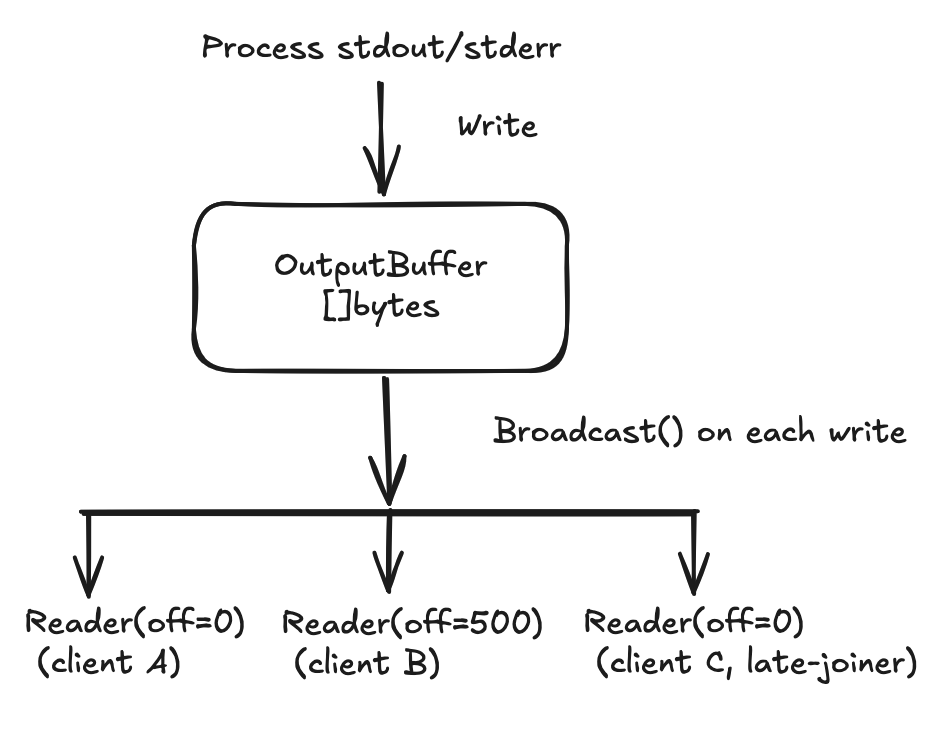
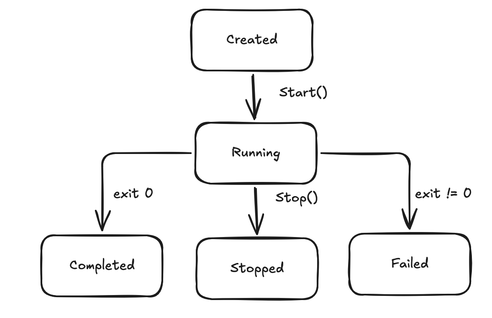

# Design: Job Worker Service

## What

A prototype job worker service that works on 64 bit Linux. It comprises of three components: a reusable library implementing the functionality for working with jobs, a gRPC API server secured with mTLS and a CLI client.

The service executes arbitrary Linux processes, manages their lifecycle (start, stop, query status) and streams output to multiple concurrent clients in real-time.

Target: Level 4

## Why

The Teleport systems engineering challenge requires building a prototype job worker service which demonstrates good process management, secure transport and concurrent streaming. The designed system must be safe, correct and minimal.

## Design details

### Scope

**In-Scope:**
- Process lifecycle management (start, stop, query)
- Efficient output streaming without polling. 
    - Support multiple concurrent clients and late-joiners
- Process based job termination
- gRPC API with mTLS and certificate based authorization
- Binary safe output handling

**Out-of-Scope:**
- Job persistence / crash recovery
- Graceful SIGTERM termination. SIGKILL only supported.

### Architecture

Three components with clear separation:


- Library: Contains process execution, state machine and output buffer. Has no knowledge of transport or auth.
- gRPC Server: Thin wrapper mapping RPCs to library calls. It owns mTLS and authorization.
- CLI: Subcommands that maps to RPCs. It writes the raw bytes to stdout.

### Process execution

For spawning services and running processes, the decision is to use `os/exec.Cmd` with `cmd.Stdout = Writer` and `cmd.StdErr = Writer`. 

As noted above, stdout and stderr are combined into a single stream. This simplifies the streaming infrastructure and also maps how `kubectl logs` behaves today.

Alternatives considered:
- Using `StdoutPipe()` + `io.Copy` goroutines. While this is a valid alternative, to keep it simple and avoid the `StdoutPipe` and `Wait` coordination issue.
- `CombinedOutput()` does not satisfy the criteria of real time streaming as it blocks until process completion.

### Output Streaming

For capturing the stdout/stderr and multiple clients streaming the job's output in real time, including late joiners, without polling.

To achieve this, the decision is to use a shared growable `[]byte` buffer that is protected by a `sync.Mutex`, with `sync.Cond.Broadcast()` for subscriber notification. Each subscriber tracks its own read offset.

This method satisfies:
- Late joiners: Each reader starts at offset=0
- No Polling: `sync.Cond.Wait()` truly blocks a goroutine and consumes zero CPU
- Independent reader: Each reader has their own offset
- Readers can exit early without affecting the underlying job or other active readers
- Binary safe: Everything is `[]byte` e2e

Some considerations:
- `sync.Cond.Wait()` cannot be interrupted by context. A fix for this is to spawn a goroutine helper that calls `Broadcast()` on `ctx.Done()` and check `ctx.Err()`. The helper can then be cleaned up via `done` preventing any leaks.
- Each stream handler goroutine is independent and hence if a stream blocks on a slow client, only that reader will be affected. The buffer's `Write()` is unaffected.
- A known limitation here is that the buffer keeps growing with process output. A mitigation here would be to have a max size configured and stop recording with the threshold reaches. This part would be skipped and is a TODO.



Alternatives considered:
- Channel based fan out: Late joiners cannot get output from the start as channels are forward only.
- `io.Pipe` and `io.MultiWriter`: Cannot add subscribers after process starts. 
- Using a File backed buffer: This can work using notification via `inotify` or polling, but it adds complexity in the former and violates requirements in the latter. Maybe valid for production systems, but an overkill here.

### Process termination

To handle processes, `SysProcAttr.Setpgid = true` would create a new process group. On Stop, send SIGKILL to the entire group using `syscall.Kill(-pgid, SIGKILL)`. This is a best-effort cleanup mechanism. It reliably terminates the main process and any descendants that remain in the original process group. 
To prevent `Wait()` from hanging, `cmd.WaitDelay` will be used.

`cmd.Wait()` blocks until the process exits and all I/O copying completes. `cmd.WaitDelay` forces pipe closure after the process exits. Without this, there can be a situation where a stopped job can hang the goroutine forever.

```
cmd.SysProcAttr = &syscall.SysProcAttr{Setpgid: true}

cmd.WaitDelay = 5 * time.Second
```

The alternative considered was `cmd.Process.Kill()`, but that can cause child processes to become orphaned, with no way to track or kill them.

### Job State Machine



All state transitions here are protected by `sync.RWMutex`, which allows for concurrent status reads.
Transitions here are validated as well. Example: Cannot go from Completed to Running.

### Library API

The library exposes a Go API with no knowledge of gRPC, TLS, or transport. The gRPC server is a thin wrapper that maps RPCs to these calls.

#### OutputBuffer

`OutputBuffer` is a shared container that stores bytes of output as they arrive. It is append-only and implements io.Writer.

```go
type outputBuffer struct { /* sync.Mutex, sync.Cond, []byte, closed bool */ }

// Write appends data and wakes all waiting readers
func (b *outputBuffer) Write(p []byte) (int, error)

// NewReader returns a new io.ReadCloser starting at offset 0
func (b *outputBuffer) NewReader() io.ReadCloser

// Close marks the buffer as complete
func (b *outputBuffer) Close()
```

#### Reader

`Reader` implements `io.ReadCloser`. The `Read(p []byte)` API. It yields bounded chunks (the caller controls the buffer size).
`io.Reader` does not have a built-in way to cancel a blocked read, so it is wired through `Close()`:

```go
go func() { <-ctx.Done(); reader.Close() }()
```

`Close()` sets a flag and calls `Cond.Broadcast()`, waking any blocked `Read`, which then observes the closed flag and returns `io.EOF`.

```go
// reader is the implementation returned as io.ReadCloser
// It provides a per-client view into an OutputBuffer, tracking its own offset
type reader struct { /* buffer *OutputBuffer, offset int, closed bool */ }

// Read blocks on sync.Cond until data is available, the buffer is closed
// upstream, or the reader itself is closed
// Chunk size is bounded by len(p)
func (r *reader) Read(p []byte) (n int, err error)

// Close unblocks any pending Read, which returns io.EOF
func (r *reader) Close() error
```

#### Job

`Job` is the internal record the Worker holds for each job.

```go
type job struct {
    mu         sync.RWMutex
    id         string
    command    string
    args       []string
    state      JobState
    exitCode   *int
    errMsg     string
    startedAt  time.Time
    finishedAt time.Time
    buffer     *OutputBuffer
    cmd        *exec.Cmd 
}
```

#### Worker

`Worker` is the in-memory registry and lifecycle manager for every job the library has launched.
It is the in-memory coordinator for all jobs started by the library. It stores jobs by ID (the worker creates a UUID for each job), starts and stops processes, tracks each job’s lifecycle as it moves from running to a terminal state, and returns read-only snapshots for status APIs.
It also manages each job’s shared stdout/stderr buffer and gives every output consumer its own reader into that buffer. This means clients can stream output independently: a slow reader does not block other readers, and a client that joins late can still replay output from the beginning.

```go
type Worker struct { /* sync.RWMutex, map[string]*job */ }

// Start creates a new job, executes the command, and returns the job ID
func (w *Worker) Start(ctx context.Context, cmd string, args []string) (string, error)

// Stop kills a running job
// Returns an error if the job is not in the Running state
func (w *Worker) Stop(ctx context.Context, jobID string) error

// Status returns a snapshot of the job's current state and metadata
func (w *Worker) Status(ctx context.Context, jobID string) (JobInfo, error)

// StreamOutput returns an io.ReadCloser for the job's output buffer
// The caller reads from offset 0 regardless of when the job started or
// whether it has already completed
func (w *Worker) StreamOutput(ctx context.Context, jobID string) (io.ReadCloser, error)
```

#### JobInfo

```go
// JobInfo is a read-only value snapshot returned by Status
type JobInfo struct {
    ID         string
    Command    string
    Args       []string
    State      JobState    // Running, Completed, Failed, Stopped
    ExitCode   *int
    Error      string
    StartedAt  time.Time 
    FinishedAt time.Time
}
```

#### Relationship to gRPC Layer

The gRPC server takes a `WorkerService` interface and acts as a thin adapter:

```go
// WorkerService defines the operations the gRPC layer depends on
type WorkerService interface {
    Start(ctx context.Context, cmd string, args []string) (string, error)
    Stop(ctx context.Context, jobID string) error
    Status(ctx context.Context, jobID string) (JobInfo, error)
    StreamOutput(ctx context.Context, jobID string) (io.ReadCloser, error)
}

type Server struct {
    worker WorkerService  // interface, not concrete *Worker
}
```

### Configuration

#### gRPC Definition

```protobuf
package jobworker.v1;

service JobWorker {
  // Starts a new job executing the given command
  rpc Start(StartRequest) returns (StartResponse);

  // Stops a running job
  rpc Stop(StopRequest) returns (StopResponse);

  // Returns the current state and metadata of a job
  rpc Status(StatusRequest) returns (StatusResponse);

  // Streams process output (stdout+stderr) from the start of execution
  rpc StreamOutput(StreamOutputRequest) returns (stream OutputChunk);
}

message StartRequest {
  // Executable path or name
  string command = 1;

  // Arguments to execute
  repeated string args = 2;
}

message StartResponse {
  // UID for a created job
  string job_id = 1;
}

message StopRequest {
  // UID for a job to stop
  string job_id = 1;
}

message StopResponse {}

message StatusRequest {
  // UID to query a job's status
  string job_id = 1;
}

message StatusResponse {
  // UID of a job
  string job_id = 1;

  // Executable path or name
  string command = 2;

  // Arguments to execute
  repeated string args = 3;

  // State of a job
  JobState state = 4;

  // A job's exit code. Meaningful only when state is COMPLETED or FAILED
  int32 exit_code = 5;

  // Readable error messages
  string error = 6;         

  // Job started using Unix timestamp seconds    
  int64 started_at = 7;

  // Job finished using Unix timestamp seconds
  int64 finished_at = 8;
}

enum JobState {
  JOB_STATE_UNSPECIFIED = 0;
  JOB_STATE_RUNNING = 1;
  JOB_STATE_COMPLETED = 2;
  JOB_STATE_FAILED = 3;
  JOB_STATE_STOPPED = 4;
}

message StreamOutputRequest {
  // // UID of a job whose output to stream
  string job_id = 1;
}

message OutputChunk {
  // // Chunk of process output.
  bytes data = 1;
}
```

#### Error Handling

| Scenario | gRPC Code |
|----------|-----------|
| Job not found | `NOT_FOUND` |
| Unauthorized CN | `PERMISSION_DENIED` |
| Insufficient role | `PERMISSION_DENIED` |
| Job already stopped/completed | `FAILED_PRECONDITION` |
| Invalid request (empty command) | `INVALID_ARGUMENT` |
| Process execution failure | `INTERNAL` |


## Security Considerations

### Transport: mTLS with TLS 1.3

Only TLS 1.3 connections are allowed. In Go, TLS 1.3 already uses only modern and secure encryption options by default. It also keeps things simple. 

The server is configured with `tls.RequireAndVerifyClientCert` so every client must present a valid certificate, preventing anonymous client connections.

### Certificate Generation

For the prototype, certs are pre-generated locally on demand using `make certs`, which runs a small script to create a self-signed development PKI. This target runs a small script that creates a self-signed development PKI and writes the output to local files. These certificates are not committed to the repository and are intended only for the prototype environment. Private keys are written with mode `0600`.

The certificates use ECDSA P-256 keys with 365 days validity. This keeps keys and certificates small and is a good fit for a TLS 1.3 service. Rotation and revocation are out of scope.


### Authentication

Authentication here is handled my mTLS. The server is configured with `tls.RequireAndVerifyClientCert`:
- Every connection must present a client certificate
- Only accept client certificates that trace back to our own CA. Reject certificates issued by anyone else
- Expiry, key usage, and chain validation are enforced by `crypto/tls` in Go

We identify the user using Common Name (CN) like `alice`, `bob` or `charlie` to keep things simple. 
For the prototype, CN is assumed to be a unique identity. Handling duplicate human-readable names is out of scope.
For a production service, this is not recommended and using an approach such as SAN URIs is better. 

The service will also not support certificate revocation, but that would be something to strongly consider for production systems.

### Authorization

After mTLS proves who the client is, a layer of authorization is added to determine what the client can do. 
The design decision here is having a hard coded CN to role map, enforced via gRPC interceptors.

Authorization Flow:
- Extract CN from verified CN Cert (Authentication is already done)
- Look up CN in map -> role (admin, viewer, unknown)
- If allowed -> proceed to handler
- If denied -> return PERMISSION_DENIED immediately

The design principle here is Deny by Default. Any combination not in the map is denied. 

This check runs on every RPC call and not just at connection establishment. Authorization is enforced per call and not per connection as a single TLS connection can have multiple gRPC streams. 
Both gRPC unary and stream interceptors are needed as `StreamOutput` uses the stream interceptor path, while Start/Stop/Status uses the unary path.

The design described above is simple as serves its purpose. A dynamic auth (RBAC, OPA/ABAC) was not chosen as it adds complexity for the service. 
All admins can stop the job. Similarly, viewers can view any job, even if they did not create it.

**Role matrix:**

| Role | Start | Stop | Status | StreamOutput |
|------|-------|------|--------|-------------|
| admin | yes | yes | yes | yes |
| viewer | no | no | yes | yes |
| unknown | no | no | no | no |

## CLI UX

The CLI resolves client certificates in the order of precedence: 
- Explicit flags
- Env variables
- default paths

This means that certs can be configured once and omitted from subsequent commands:

```bash
# Option 1: Environment variables (set once per shell session)
export JOBWORKER_CERT=certs/alice.crt
export JOBWORKER_KEY=certs/alice.key
export JOBWORKER_CA=certs/ca.crt

# Option 2: Default paths (zero config after initial setup)
mkdir -p ~/.jobworker/certs
cp certs/alice.crt ~/.jobworker/certs/client.crt
cp certs/alice.key ~/.jobworker/certs/client.key
cp certs/ca.crt    ~/.jobworker/certs/ca.crt
```

### Examples

```bash
# Generate test certificates
make certs

# Start the server
./jobworker-server \
  --cert certs/server.crt \
  --key certs/server.key \
  --ca certs/ca.crt \
  --listen :50051

# Start a job (admin only)
# Everything after "--" is the command + args
./jobworker-cli \
  --cert certs/alice.crt --key certs/alice.key --ca certs/ca.crt \
  start -- ls -la /tmp
# Output: 550e8400-e29b-41d4-a716-446655440000

# Remaining examples assume env vars or default paths are configured 

# Stream output (admin or viewer)
./jobworker-cli stream 550e8400-e29b-41d4-a716-446655440000
# Output: (raw process stdout+stderr streamed to terminal)

# Query job status
./jobworker-cli status 550e8400-e29b-41d4-a716-446655440000
# Output:
#   ID:        550e8400-e29b-41d4-a716-446655440000
#   Command:   ls -la /tmp
#   State:     COMPLETED
#   Exit Code: 0

# Stop a running job (admin only)
./jobworker-cli stop 550e8400-e29b-41d4-a716-446655440000

# Viewer attempting to start (denied: charlie maps to the viewer role)
JOBWORKER_CERT=certs/charlie.crt JOBWORKER_KEY=certs/charlie.key ./jobworker-cli start -- echo hello
# error: permission denied: role "viewer" cannot call Start
```

## Implementation Plan

| PR | Scope |
|----|-------|
| PR1 | Core library with  process lifecycle, output buffer with sync.Cond, process group kill, unit tests |
| PR2 | gRPC API + mTLS + authorization interceptors + server binary + cert generation |
| PR3 | CLI client with subcommands, mTLS flags, raw binary output to stdout |
| PR4 | Integration tests + README |